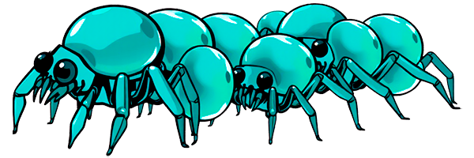
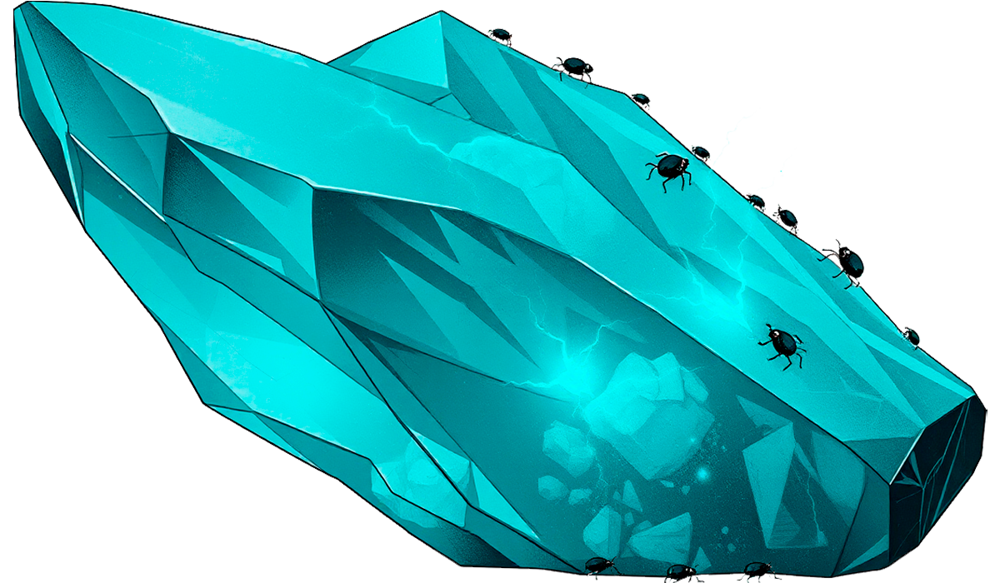
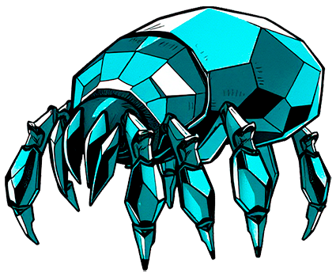
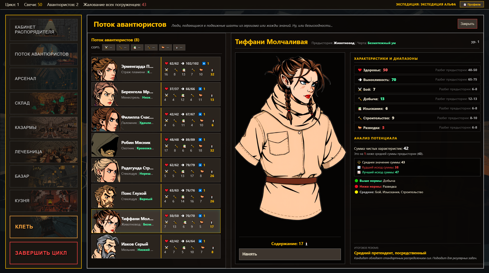
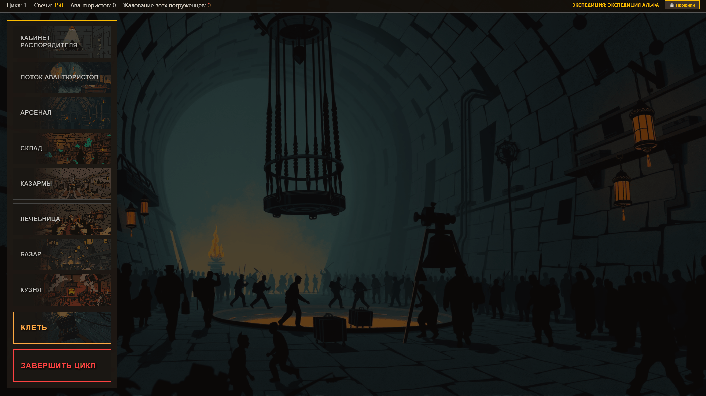
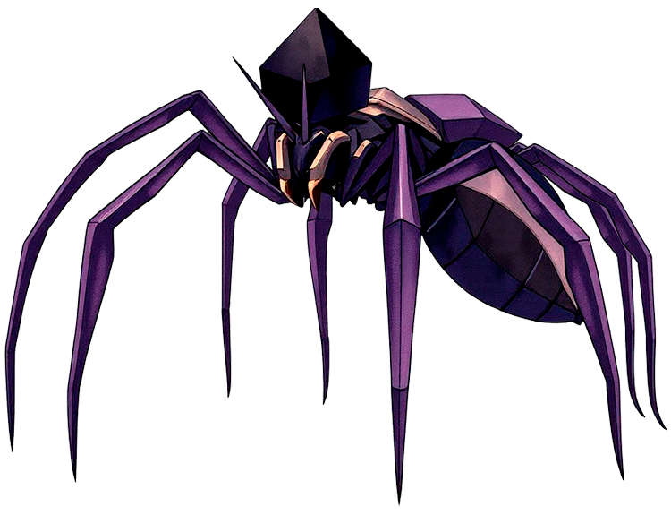
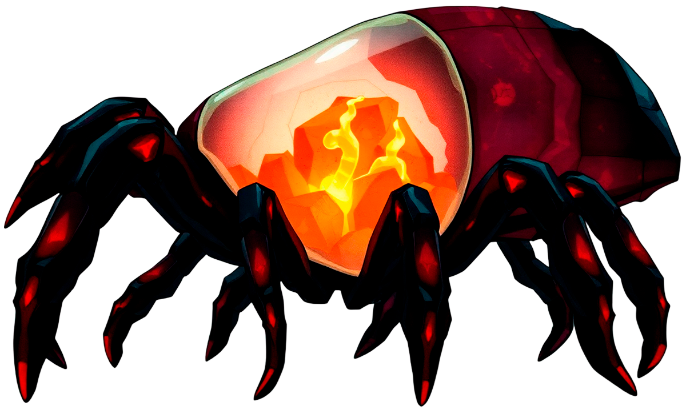
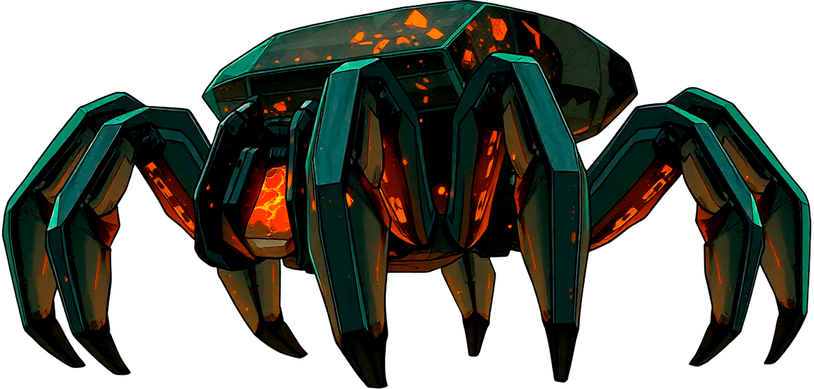

# ⛏️ Симулятор шахтёрских экспедиций (Litho Descent)

[](https://thishappyel.github.io/diploma-project-Mines-expedition-/)
[](#)

<div>
  
  
  
</div>

Браузерная игра-симулятор управления отрядом наемников с экономикой, абстрактным исследованием подземных локаций и тактическими пошаговыми боями. 

🎮 **[ИГРАТЬ ПРЯМО СЕЙЧАС (Live Demo)](https://thisishappyel.github.io/diploma-project-Mines-expedition-/)**

<div align="center">
  
</div>

---

## 🌟 Ключевые особенности

- **Бесклассовая система:** Навыки бойца в бою зависят исключительно от того, какое оружие он держит в руках.
- **Динамические аватары:** Внешний вид персонажей генерируется "на лету" из множества слоев (тело, одежда, прическа, капюшоны, оружие).
- **Абстрактные экспедиции:** Исследование подземелий реализовано через менеджмент темпа и шкал прогресса, а не классическое перемещение по клеткам.
- **Пошаговый тактический бой:** Сражения на линии (4x4) с учетом инициативы, брони, уклонений и синергии статус-эффектов.
- **Data-Driven архитектура:** Весь баланс (враги, предметы, характеристики) вынесен в отдельные  конфигурационные файлы.

---

## 📖 Как играть (Мини-обучение)

В текущей версии нет обучения внутри игры, поэтому вот краткое руководство. Игровой цикл делится на 3 этапа: **База (Хаб) ➔ Экспедиция ➔ Бой**.

### 1. Хаб (Управление базой)
Ваша задача — собрать отряд и подготовить его к спуску.
* **Поток авантюристов:** Здесь можно нанять рекрутов. Обращайте внимание на их *предысторию* и *черты* — они формируют базовые характеристики.
* **Кузня/Базар:** Покупайте оружие и броню. Оружие дает активные навыки для боя. На старте есть два комплекта еды и воды, но после нужно будет покупать их самостоятельно. Без них погруженцам будет сложно восстановить силы под землёй. В какой-то момент для продолжения работы могут понадобиться инструменты. Их наличие изначально ускоряет работу, но с некоторых этапов они становятся обязательными для работы.
* **Арсенал:** Вооружите нанятых погруженцев более подходящей одеждой и оружием, чтобы они были способны постоять за себя в опасной ситуации.
* **Казармы и Лечебница:** После экспедиции выжившие будут истощены. Отправьте их отдыхать (восстановление выносливости) или лечиться (восстановление ХП) за счет ваших Свечей (валюты).
* **Конец цикла:** Когда экспедиция уже была завершена и в текущий цикл вам больше нечем заняться - жмите конец цикла. С вашего баланса валюты спишется жалование работникам, а также оплата постоя в бараках и персонала в лечебнице. *Следите за бюджетом: долг в течение нескольких циклов приведет к поражению!*

<div align="center">
  
</div>

### 2. Экспедиция
Сформируйте отряд до 4 человек в **Клети** и спускайтесь вниз.
* **Пауза:** При входе в пещеры игра встаёт на паузу. Вы можете ознакомиться со всем необходимым и продолжить, когда будете готовы, а аткже вновь нажать паузу при необходимости.
* **Прогресс:** Скорость заполнения шкалы зависит от суммы навыков ваших рабочих. При желании вы можете выбрать определённый вид работ как приоритетный, тем самым значительно ускорив ведущиеся в нём работы, но замедлив все прочие.
* **Темп работы:** Вы можете ускорить работу (кнопка "Темп"), но это быстрее отнимет выносливость и здоровье рабочих, а также ускорит накопление шкалы **Угрозы**.
* **Привал (Отдых):** При полном истощении здоровья и выносливости всех погруженцев в шахтах экспедиция будет считаться пропавшей без вести. Чтобы этого не допустить следите за показателями людей и остановите работу, нажав "Привал", чтобы восстановить выносливость и здоровье погруженецв. При наличии в инвентаре экспедиции еды и воды они потратятся по одной на каждого, значительно усилив весь дальнейший в течении цикла отдых.
* **Угроза:** Показатель того, насколько местные обитатели раздражены присутствием посторонних. С определённого этапа (25% заполнения шкалы) Вы можете сами спровоцировать бой. На 50% бой будет неизбежен при попытке покинуть пещеры. Далее предстоящий бой будет расти в сложности.

<div align="center">
  
</div>

### 3. Тактический бой
Если вы инициируете бой, или оказались достаточно назойливы, чтобы местная фауна напала сама - начинается бой.
* **Очередь ходов:** Зависит от инициативы (характеристика "Бой" + бросок кубика).
* **Позиционирование:** У каждого навыка оружия есть "Подходящая позиция" (откуда бить) и "Доступная цель" (по кому бьет). Перемещайте бойцов, если они оказались не на своей линии.
* **Синергия и эффекты:** В игре есть много различных эффектов, которые могут накладывать навыки погруженцев и их враги. Чтобы ознакомиться с ними вы можете навестись на изображение эффекта под полоской хп юнита, на которого тот наложен.
* * **Тяжесть боя:** Практически каждое действие в бою расходует выносливость погруженца. Если она полностью иссякла вам не останется ничего другого, кроме как пропустить им ход, чтобы перевести дух После исчерпания здоровья погруженец выбывает из боя, но не погибает, если хотя бы кто-то выживет в бою.

<div align="center">
  
</div>

---

## 🛠 Технологический стек
Проект разработан без использования тяжелых игровых движков (Unity/Godot) или UI-фреймворков (React/Vue) для демонстрации навыков проектирования чистой архитектуры.

* **Frontend Ядро:** Vanilla JS (ES6+), HTML5, CSS3 (Flexbox).
* **Рендеринг:** HTML5 Canvas API (для отрисовки динамических сцен и боя).
* **Сборка и CI/CD:** Vite, GitHub Actions, GitHub Pages.
* **Хранение данных:** `localStorage` (JSON-состояния) + асинхронное резервное копирование на Node.js сервер (Render).
* **Ассеты:** Сгенерированы локально с помощью ИИ (Stable Diffusion с Flux в качестве модели) и обработаны вручную.

---

## 🚀 Локальный запуск (Для разработчиков)

1. Клонируйте репозиторий:
   ```bash
   git clone https://github.com/ThisHappyEL/diploma-project-Mines-expedition-.git
   ```

2. Перейдите в папку проекта:
   ```bash
   cd diploma-project-Mines-expedition-
   ```

3. Запустите локальный dev-сервер Vite:
   ```bash
   npm run dev
   ```
  
4. Откройте предоставленный локальный адрес (обычно http://localhost:5173) в браузере.

<div>
  
  
  
</div>